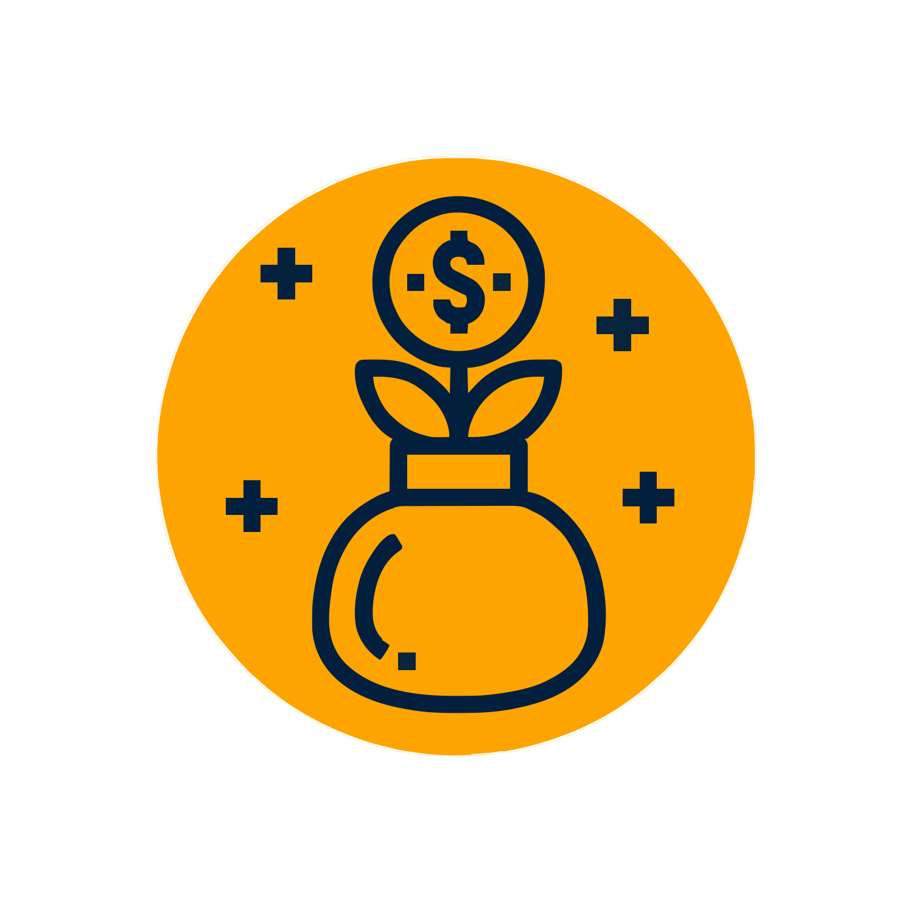

<!-- Don't delete it -->
<div name="readme-top"></div>

<!-- Organization Logo -->
<div align="center">
  
  &nbsp;&nbsp;&nbsp;
  
  &nbsp;&nbsp;&nbsp;
  
</div>

&nbsp;

<!-- Organization Name -->
<div align="center">

[](https://bene-evm.stability.nexus/)

</div>

<!-- Social Links -->
<p align="center">
<a href="https://t.me/StabilityNexus">
</a>
&nbsp;&nbsp;
<a href="https://x.com/StabilityNexus">
</a>
&nbsp;&nbsp;
<a href="https://discord.gg/YzDKeEfWtS">
</a>
&nbsp;&nbsp;
<a href="https://news.stability.nexus/">
</a>
&nbsp;&nbsp;
<a href="https://linkedin.com/company/stability-nexus">
</a>
&nbsp;&nbsp;
<a href="https://www.youtube.com/@StabilityNexus">
</a>
</p>

&nbsp;

<p align="center">
  <strong>
    Bene allows project owners to raise funds for their projects and reward funders with Proof-of-Funding tokens (PFTs).
  </strong>
</p>

---

# Bene-FundRaising-EVM-Contracts

This repository contains the **EVM smart contracts** for the Bene Fundraising Protocol.

- Contract folder: `/packages/hardhat/contracts`
- Explainer Video:  
  🎥 https://www.youtube.com/watch?v=HHN31PkUxaU
- Frontend Deployment:  
  👉 https://bene-evm.stability.nexus

---

## 🧠 Overview

Bene enables decentralized fundraising by allowing projects to create funding vaults where users contribute ETH and receive **Proof-of-Funding Token Vouchers (PFTVs)**.  
Depending on whether the project reaches its minimum funding goal before the deadline:

- Users may **refund** their ETH, or  
- Users may **redeem** PFTVs for **PFTs**, and the project owner may **withdraw** the raised ETH.

---

# 🔍 How It Works

### **Project Owners Can Configure:**

- **Exchange rate** → PFTs per unit of ETH  
- **Minimum funding amount** → Required amount to succeed  
- **Deadline**  
- **Withdrawal address**  
- **Project metadata** (title, description, URL)

### **Users Can:**

- Provide funding → Receive PFTVs  
- Redeem PFTVs → For PFTs (if goal met)  
- Refund funding → If goal not met before deadline  

### Why PFTVs?

PFTVs prevent unfair refunds by ensuring **only real contributors** during the active fundraising period can request refunds.

---

# 📦 Funding Vault Parameters

Each vault contains:

- **timestamp** – deadline for refund/withdrawal  
- **Minimum Funding Amount** – required ETH to succeed  
- **Proof-of-Funding Token Address** – ERC20 PFT contract  
- **Total PFT Amount** – total tokens allocated  
- **ETH/Token Exchange Rate**  
- **withdrawal_address** – project owner’s ETH address  
- **Project Title**  
- **Project URL**  
- **Project Description**  

---

# ⚙️ Protocol Constants

- **Protocol Treasury Address (`dev_addr`)**  
- **Protocol Fee (`dev_fee`)** — e.g., `5` means 5%

---

# 🔄 Processes

### **1. Funding Vault Creation**
- Open to anyone  
- Project owner provides tokens  
- Vault is initialized with parameters  

### **2. Token Acquisition**
- Users buy PFTVs with ETH at the set exchange rate  
- Allowed until tokens run out  

### **3. Refund Tokens**
Allowed only when:
- Deadline has passed  
- Minimum funding goal NOT reached  

Users receive ETH back proportional to PFTVs returned.

### **4. Withdraw ETH**
Allowed only when:
- Minimum funding amount HAS been reached  
ETH goes to `withdrawal_address`.

### **5. Withdraw Unsold Tokens**
Project owner can withdraw remaining PFTs anytime.

### **6. Add Tokens**
Project owner can add more PFTs to the vault.

### **7. Redeem Tokens**
Allowed only when:
- Deadline passed  
- Minimum funding amount reached  

Users receive final PFTs.

---

# 🛠 Installation & Deployment

### Clone the Repository

```bash
git clone https://github.com/StabilityNexus/BenefactionPlatform-EVM
cd BenefactionPlatform-EVM
```

### Install Dependencies

```bash
npm install
```

### Deploy Contracts

```bash
yarn deploy
```

### Deployed Contracts

- **FundingVaultFactory**:  
  `0x55cbF8284EDCd412bbac595b33Be1Ecdd04a79B7`

---

# 🤝 Contributing

We welcome contributions!  
If you wish to improve the protocol or contracts:

1. Fork the repository  
2. Create a feature branch  
3. Submit a pull request  

For discussions or help → join the Stability Nexus Discord.

---

© 2025 The Stable Order
